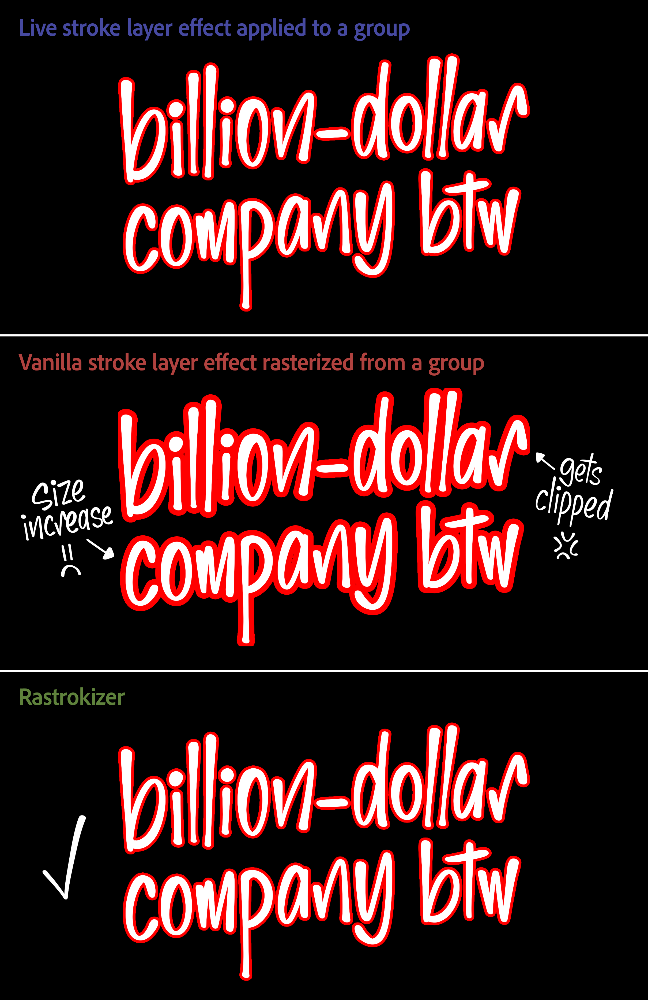

# Rastrokizer

Move a Photoshop group's outside stroke onto its own pixel layer, faithfully, in one history step.

## Why

*Layer > Layer Style > Create Layers* is meant to turn a layer's live effects into ordinary layers, but on a **group** it gets the outside stroke wrong — and has since at least Photoshop 23.4.1 (2022), still unfixed in Photoshop 2026 (27.9.1). It rebuilds the stroke from the group's finished composite and clips it to the original bounds, so an 8 px stroke comes out about 8 px along straight edges but roughly 16 px into the corners: doubled and squared (the middle panel above). *Merge Group*, *Rasterize Layer Style*, and *Create Layers* on a plain layer are all exact, so Rastrokizer builds the stroke layer from those instead (the bottom panel).

## Use

Select the group, then *File > Scripts > Browse…* and pick *Rastrokizer.jsx*. The group's Stroke moves to a new layer directly below it, named after the group — `Border's Outer Stroke` for a group named `Border` — and carrying the stroke's own blend mode. Everything else about the group is left exactly as it was: blend mode, opacity, fill, knockout, Blend If, and the rest all survive, because only the Stroke is removed and nothing is reset. It is one history step, so *Undo* reverts everything. (The script overwrites whatever you last copied with *Copy Layer Style*.)

## What it handles

Measured against Photoshop's live render (premultiplied, 256 px fixtures, Photoshop 27.9.1); "exact" is a 0 px difference.

- **Exact:** Pass Through or Normal groups at 100 % opacity and fill over opaque content; all 27 stroke blend modes; the occluding group modes (Multiply, Darken, and the rest that hide the content); group fill 0 %; stroke sizes 0.5–250 px; RGB, Grayscale, CMYK, and Lab; 8, 16, and 32 bit; smart objects, rectangles, hard and concave silhouettes, and multiple children.
- **A one-pixel edge band** — at most about 68/255, right where the content meets the stroke — for the non-occluding group modes (Screen, Overlay, Hue, and the rest), group opacity or fill below 100 %, a stroke below 100 % opacity, and knockout. This band is *provably irreducible* for a stroke on its own layer; see [the known limitations](docs/LIMITATIONS.md).
- **Refused, with the reason in a dialog:** Inside and Center strokes, gradient and pattern strokes, live text, a style with any other effect, and masked or clipped groups. For Inside and gradient strokes the [Action recipe](docs/AS_AN_ACTION.md) is exact.

## Verifying

*verify/verify.jsx* builds each case twice, exports the live render and the converted render, and *verify/grade.py* compares them and checks the group's structure. Run it with *verify/run.ps1* from a PowerShell prompt while Photoshop 2026 is open with no documents you care about; it only ever touches documents it creates.

## Documentation

- [Known limitations](docs/LIMITATIONS.md) — every divergence and refusal, each shown to be a Photoshop limit or a scoped choice with an exact alternative, with the pixel math.
- [How it works](docs/HOW_IT_WORKS.md) — the construction step by step, and why removing the Stroke is non-destructive.
- [Recording it as an Action](docs/AS_AN_ACTION.md) — the same result as a Photoshop Action, which also handles gradient, pattern, and Inside strokes.
